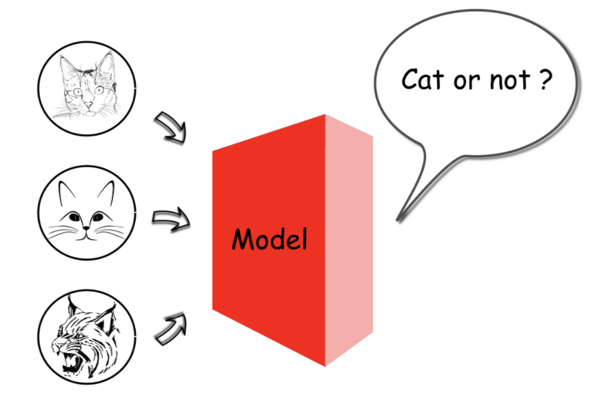
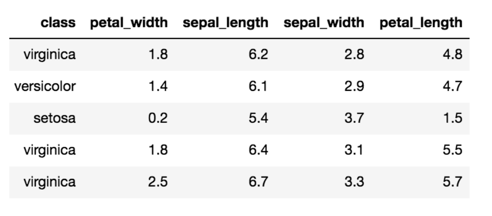
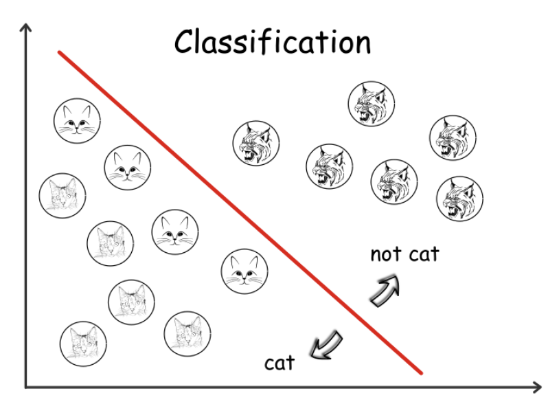
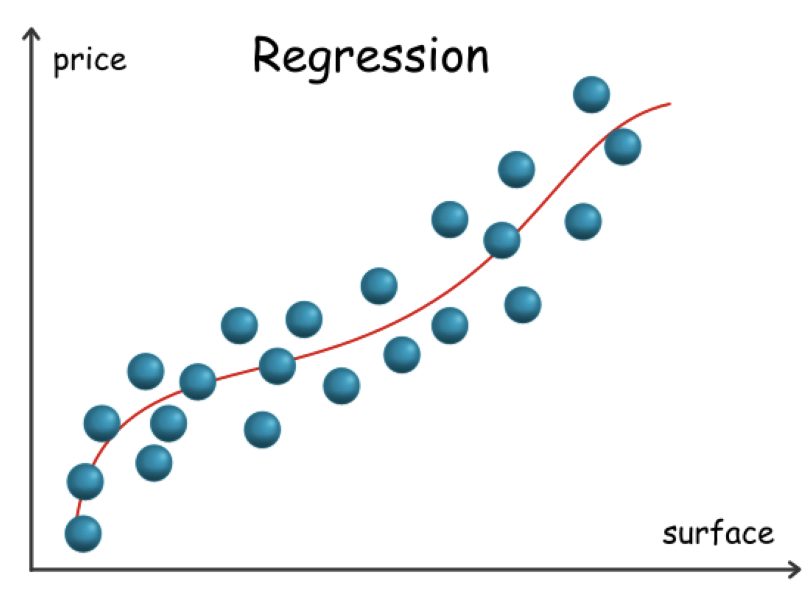
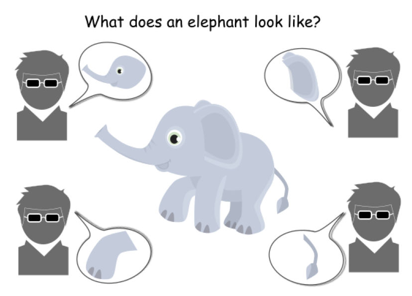
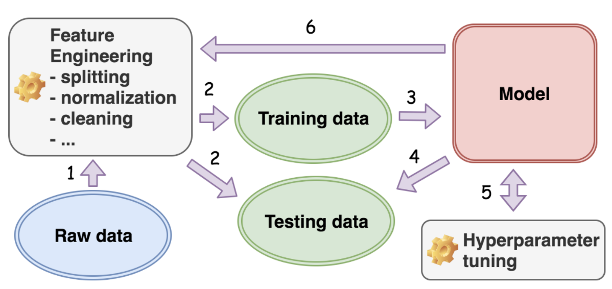
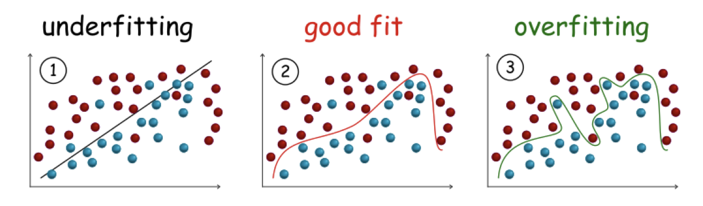

# Machine Learning Graduate Studies
The purpose of these notes are to
- Identify different types of machine learning problems
- Know what a machine learning model is
- Know the general workflow of building and applying a machine learning model
- Know the advantages and disadvantages about machine learning problems

## Machine Learning Model
To start off, machine learning nowadays does not go beyond a computer program that
performs the predefined procedures. What truly distinguished a machine learning algorithm
from a non machine learning algorithm, such as a program that controls traffic lights,
is its ability to **adapt** its behaviours to new input. This adaption seems to imply
that the machine is actually **learning**. However, under the hood, this perceived
adaption of behaviours is as rigid as every bit of machine instructions.

A machine learning algorithm is the process that uncovers the underlying relationship within
the data. The outcome is called the **machine learning model**. The model changes when fed
different data, meaning the function is not predefined and fixed.

The input of the generated model here would be a digital photo, and the output is a boolean
value indicating the existence of a cat in the photo.



The model for the above case is a function that maps multiple dimensional pixel values
to a binary value. For example, assume we have a photo of 3 pixels, and the value of each
pixel ranges from 0 to 255. The mapping space between the input and output would be
**(256 X 256 X 256) X 2**, which is around 33 million. This task of learning the mapping
might be daunting; however,
```
The task of machine learning is to learn the function from the vast mapping space
```
The results of the machine learning model is often not 100% accurate. Before the wide
application of deep learning in 2012, the best machine learning model could only achieve
75% accuracy in the [ImageNet visual recognition challenge](http://www.image-net.org/).

## Supervised VS. Unsupervised
When first given a machine learning problem, one can determine whether it is a **supervised**
or **unsupervised** problem. We start from a data set, which consists of a group of
**samples**, and each sample can be represented as a tuple of **attributes**. A famous
data set called [Iris](https://archive.ics.uci.edu/ml/datasets/iris) consists of different
measurements for 150 samples of iris flower. Below is a sample of this data set:



### Supervised Learning
There is a **ground truth** attribute for these models. This target attribute serves as a
teacher to guide the learning task. It provides a benchmark on the results of learning. Hence,
the task is called supervised learning. The class attribute (virginica, versicolor, setosa,
etc...) of the iris dataset can server as a target attribute. The data with a target attribute
is often called **"labeled"** data. We should now be able to determine that the task of
predicting the category of iris flower with the labeled data is a supervised learning task.

### Unsupervised Learning
An **unsupervised** learning task does not have the ground truth. We are expected to learn the
underlying patterns or rules from the data without having the predefined ground truth as the
benchmark. Here are a few examples:

- **Clustering**: one can cluster the samples from a data set into groups based on similarities
among the samples within the data set. An example of clustering is a sample of a customer
profiles and how many items were purchased or what time the customer visited the shopping
site. After clustering customer groups together, one could devise commercial campaigns targeting
each group.

-**Association**: uncovering the hidden association patterns among the attributes of a sample.
A shopping cart of a customer could be seen as a sample, and each attribute of the sample is
a piece of merchandise. Maybe we can derive that customers who bought beers often bought diapers
as well.

### Semi-supervised Learning
A data set might be massive but the labeled sample are few. In this case, we can apply
both supervised and unsupervised learning. An example is how it took 2.5 years for the
research team at Stanford to curate the famous ImageNet, which contains millions of
images with thousands of manually labeled categories. Often is the case that one has a
large amount of data, yet few of them are accurately "labeled". For example, videos without
a category or even a title.

If only 10% of images in a data set are labeled, by applying supervised learning, we train
a model with the labeled data. Next, we apply the model to predict the unlabeled data. This
approach is not convincing; how general can this model be if we learnt from only a minority
of the data set. Therefore, we first cluster the images into groups (unsupervised learning).
Next, we apply the supervised learning algorithm on each of the groups individually. In this
scenario, the unsupervised learning first narrows down the scope of learning so that the
supervised learning in the second stage could obtain better accuracy.

## Classification vs Regression

We can further distinguish the machine learning models as **classification** and
**regression** based on the type of output values.

```
If the output of a machine learning model is discrete, such as a boolean value, then we call
it a classification model. A model that outputs continuous values is a regression model.
```

### Classification Model
The model that tells whether a photo contains a cat or note can be considered as a
classification model since the output is a boolean value:



A matrix M with dimensions of H x W where H is the height of the photo in pixels and W
is the width of the photo can represent the input. Now, each element within the matrix
is the grayscale value of each pixel in the photo, i.e. an integer value between [0,255]
that indicates the intensity of the color. Again, the expected output of the model would
be a binary value [1|0] that indicates whether the photo shows a cat or not. The formula
can be formulated as follows:
```
F(M[H][W])=1∣0, where M[i][j]∈[0,255], 0<i<H, 0<j<W
```
The goal of machine learning is to discover the function that is as general as possible,
which has a high probability to give the right answer for unseen data.

### Regression Model
One can consider a model that estimates the price of real estate given the characteristics
such as the surface, type type of real estate, and of course the location. We can expect
the output as a real value p∈R; therefore, it is a regression model. Not all the raw data
is numeric as some of them are **categorical**, such as the type of real estate. For each
piece of real estate, we can represent its characteristics as a tuple *T*. The elements are
also called features in many cases. The summary of the real estate model is as follows:
```
F(T)=p,where p∈R
```
If a piece of real estate were to have the following features:
```
surface = 120m^2, type = ' apartment', location = ' NY downtown', year_of_construction = 2000
```
If our model *F* was to return a value of $10,000, then we know it is not a good fit. The
following figure shows a model that takes only square footage as a variable.

Some machine learning models like the decision tree can handle directly the non-numeric
feature as it is. More often, one has to **transform** those non-numeric features into
numeric one way or another.

### Problem Conversion
Sometimes one can easily formulate a real world problem and quickly attribute it to either
a classification or regression problem. The boundary between these two types of models
might not always be clear, and one can transform a problem both ways.

The above example of real estate price estimation seems like a difficult prediction. What
if we were to reformulate the problem to predict the price range of real estate instead
of a single price tag? At this point, we can expect to obtain a more robust model. We have
also transformed the model into a classification problem instead of regression.

The cat-photo-recognition model can also be transformed from a classification problem to 
a regression one. Defining the model to give a probability value of [0,100]% would do
this transformation. If model **B** were to give a 49% probability while model **A**
gave a probability of 1%, then we can tell that model B is closer to the truth. For this
example scenario, one often applies one of the machine learning models called **logistic
regression**, which gives continuous probability values as output. It is served to
solve the classification problem.

## Data, Data, Data!
The data ends up determining the **upper bound** of performance that the model can achieve.
There are numerous models that can fit specific data, and the best we can do is to find
a model that can closely approach this upper bound.
```
Rule of thumb: Garbage in, garbage out
```
In the example of four blind men who would like to conceptualize an elephant, none of the
four would get a full picture of what it looks like if they all only touched one part of
the animal.


If the training data we received were only of those animal parts while the test processing
data are full portraits of elephants, then we can expect our trained model to perform
poorly. We do not have **high quality** data that is closer to the reality in the first
place. This issue of gathering the data the captures the essential characteristics of the
problem is a common struggle. One would not be able to learn anything from data that contains
too much noise or is too inconsistent with the reality.

## Machine Learning Workflow
What is the typical **workflow** to construct a machine learning model. One cannot talk
about machine learning without mentioning the **data**. This relationship is as crucial
as fuel to the engine of a rocket. 

### Data-Centric Workflow
```
The workflow to build a machine learning model is centralized around the data.
```
To say that the data dictates how the machine learning model is built is not exaggerating.
A typical workflow involved in a project of machine learning is illustrated below:



We first determine which type of machine learning problems we would like to solve (i.e.
supervised vs unsupervised). If the data is labeled, then one of the attributes in the
data is the desired one, i.e. the *target attribute*. A boolean of yes|no for each cat
photo could be an example of labeled data, which means it is a supervised learning
problem.

Next, we determine the type of generated model: **classification** vs **regression**. This
determination is based on the expected output of the model, i.e. discrete value for
classification model and continuous value for the regression model.

After these determinations of the type of model we would like to build, we proceed
with **feature engineering**, which is a group of activities that transform the data
into the desired format. Examples of feature engineering are:
- *Splitting** the data into two groups: training and testing. This practice is quite
common, and the training dataset is used during the process to train a model. The testing
dataset is then used to test or validate whether the model built is generic. Is the model
generic enough that we can apply it to unseen data?
- **Incomplete** points in the dataset are also common. We might need to fill in those
missing values with various strategies, one of which is just to fill with the average
value.
- **Encoding** categorical attributes like county, gender, etc.. might be necessary
due to the constraints of the algorithm. The linear regression algorithm can only deal
with vectors of real values as input.
```
Feature engineering is not a one-off step; often one needs to revisit later in the
workflow.
```
After the data is prepares, we can select one of the machine learning algorithms and
begin to feed the algorithms with the prepared **training data**. This process is
called the **training process**.

Next, after the model is obtained at the end of the training process, it is then
tested with the reserved **testing data**. This step is called the **testing process**.

After the first trained model, we will likely go back to the training process to tune
some parameters. We call this **hyper-parameter tuning**, and it is called *hyper*
because these parameters are the outermost interface that we interact with. These
hyper parameters then have impacts on the underlying parameters of the model. For example,
for the decision tree model, one of its hyper-parameters would be the maximum height of
the tree. This parameters would limit the number of branches and leaves that a decision
tree can grow at the end, which are the underlying parameters that a decision tree
model consists of.
```
As you can decipher, the steps involved in the machine learning workflow form a cycle with
a focus on the data.
```

## Underfitting vs. Overfitting
Two common cases for supervised learning algorithms (like classification and regression)
is when the generated model does not fit the data well. An important measurement which
we have mentioned before is *generalization*, which measures how well a model derived from
the training data can predict the desired attribute of the unseen data. When we say
that a model is underfitting or overfitting, it implies that the model does not generalize
well to the unseen data. It is important to note that a model that fits well to the
training data does not necessarily imply that it would generalize well to the unseen
data. There are two reasons for this implication:
1) The training data are just samples collected from the real world, which represents
only a proportion of reality. The training data could simply not be representative.
2) The data collected for the algorithm contains noise and errors. Then, the model that
fits well with the training data would also capture the undesired noise and errors by
mistake. This capturing would lead to bias and errors in the prediction for the unseen
data.

In the task of classification, here is what underfitting and overfitting models look like:



### Underfitting

An underfitting model is the one that does not fit well with the training data meaning
it is significantly deviated from the ground truth. The model might be over-simplified
for the data. In this case, the model may not be capable to capture the hidden
relationships in the data. A simple linear line is not enough to clearly draw the
boundary among the sample. Now, there is significant misclassification. We should then
choose an alternative algorithm that is able to generate a more complex model from
the training data.

### Overfitting

This model will fit well with the training data to little or no error; however, it does
not generalize well to the unseen data. A model that is able to fit every bit of data
would fall into the traps of noises and errors. The figure above reveals less
misclassification in the training data, yet it is more likely that this overfitted
model would stumble on unseen data. We can try instead a simpler model for the training
data. More commonly, one would keep the original algorithm that generated this overfitted
model and add a **regularization** term. In a way, you are *penalizing* the model that is
over-complicated so that the algorithm is steered to generate a less complicated model to
fit the data.

## Bias VS. Variance

**Bias** and **variance** are two terms that provide another perspective to the
phenomenons of *underfitting* and *overfitting*. 

```
Bias is a lerner's tendency to consistently learn the same wrong thing. Variance is the
tendency to learn random things unrelated to the real signal.
```

Let us first define the notion of **main prediction** before we dive deeper into bias
and variance. The concepts of models and loss function are covered here.

### Definitions

Given a training set s={(x<sub>1</sub>, t<sub>1</sub>), ... , (x<sub>n</sub>, t<sub>n</sub>)},
a learner, which is a machine learning algorithms, produces a model *F*. Now, given
a test example x<sub>k</sub>, this model produces a **prediction** y<sub>k</sub> = 
F(x<sub>k</sub>). Each sample in the training set consists of two elements 
x<sub>i</sub>, which is a vector of attributes associated with the sample. t<sub>i</sub>
is the target attribute to predict for the sample.

An example using these variables is as follows:
x<sub>i</sub> = (type = "apartment", location = "LA", surface = "120m<sup>2</sup>"),
t<sub>i</sub> = (price = "$420,000"). The task of a learner is to predict the price
of an estate given its properties.

So, given a training sample (x<sub>i</sub>, t<sub>i</sub>), the learner produces
a prediction as F(x<sub>i</sub>). The **loss function** L(F(x<sub>i</sub>),t<sub>i</sub>)
is the difference between the prediction F(x<sub>i</sub>) and the true value t<sub>i</sub>
associated with the sample. The larger the difference, the bigger the loss. The common
loss function, **square error**, is adopted when a target attribute t<sub>i</sub> is of
numerical value. This square error is defined as: L(F(x<sub>i</sub>), t<sub>i</sub>) =
(F(x<sub>i</sub>) - t<sub>i</sub>)<sup>2</sup>. Following the above example, if the
model F is to produce the price of the above example x<sub>i</sub> as "$410,000", then
the result of the loss function would be (420,000 - 410,000)<sup>2</sup> = 10<sup>8</sup>.

### Main Prediction

Given a loss function L and sets of training set S = {s<sub>1</sub>, s<sub>2</sub>, ...,
s<sub>n</sub>}, the main prediction for a learner is defined as y<sub>m</sub> = 
argmin<sub>y'</sub>E<sub>s</sub>(L(y,y<sup>'</sup>)).

For each training set s<sub>i</sub>, we train a model F<sub>i</sub>with a give learner.
Next, for a given training sample, we then produce a set of predictions *Y* = {y<sub>1</sub>,
y<sub>2</sub>, ..., y<sub>n</sub>} with y<sub>i</sub> corresponding to the result 
produced by the model F<sub>i</sub>. The **main prediction** y<sub>m</sub> is the
prediction y<sup>'</sup> whose average loss with regards to all the predictions in 
*Y* is minimum. This definition means the main prediction is that which "differs 
least" from all the predictions in *Y* according to *L*.

Imagine the loss function is square errorL(y, y<sup>'</sup>) =
(y - y<sup>'</sup>)<sup>2</sup>. The main prediction with regards to the entire training
set S is then the **mean of the predictions**, i.e. y<sub>m</sub> = *E*<sub>s</sub>(*Y*).

```
We can interpret the main prediction as the expected answer for a given training
sample from a given learner (a machine learning algorithm).
```

Now let's continue with an example -- a dart-throwing game where a learner is a player.
Whenever a dart is thrown, to corresponding activities occur:
1) The player poses and aims, meaning the learner trains a model from a given training
dataset.
2) The player throws the dart, meaning the model trained by the learner produces a 
prediction.

The bullseye is the target of the prediction, and the closer the dart is to the bullseye,
the better the learner (player) is.

Before each throw, we can ask ourselves, "How many points will this player score?" The best
guess we can take is the main prediction of this learner, which will in fact be the
average score that the player has achieved during all past games. 

```
Intuitively, we can consider that the main prediction is the general tendency (performance)
of a learner, i.e. expected points that a player can score in a game.
```

Let's now dive deeper into the concepts of bias and variance.

### Bias
 

